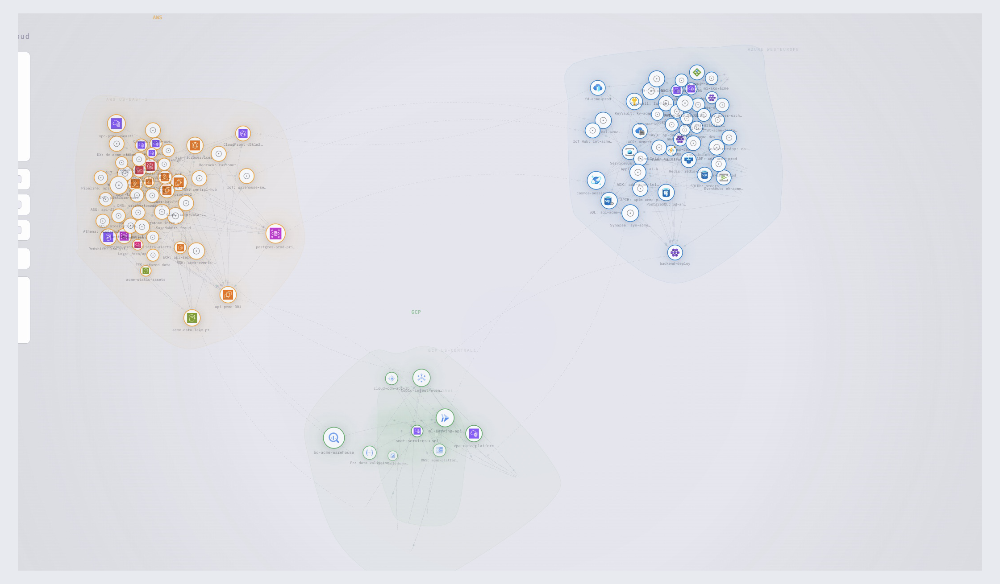
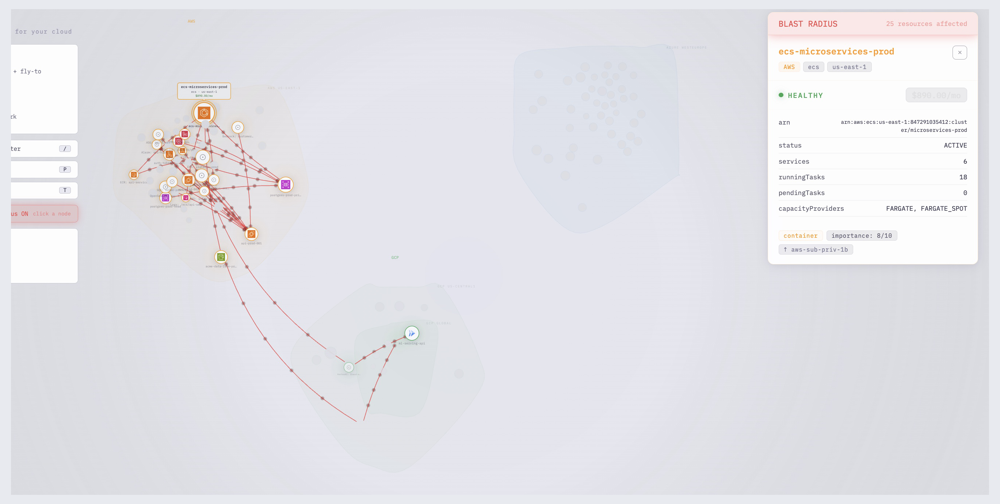

<div align="center">
  <h1>skyglass</h1>
  <p><em>A looking glass for your cloud.</em></p>

  

  <br/><br/>

  <a href="https://www.npmjs.com/package/skyglass"></a>
  <a href="LICENSE"></a>
  <a href="https://nodejs.org">= 20"></a>
  <a href="https://www.typescriptlang.org/"></a>

  <br/><br/>

  <strong><code>npx skyglass --demo</code></strong> &mdash; try it now, no credentials needed.

</div>

---

## Why

Your cloud has 200+ resources across 3 providers. The AWS Console shows you one service at a time. Terraform state is a JSON blob. CloudFormation outputs a wall of text.

Skyglass shows you **everything at once** — every resource, every connection, every dependency — in an interactive graph you can actually understand. One command. No config. No data leaves your machine.

---

## Quick Start

```bash
# Try instantly with sample data (no credentials needed)
npx skyglass --demo

# Scan your real cloud infrastructure
npx skyglass all

# Import from a Terraform state file
npx skyglass --from terraform.tfstate
```

---

## Compared to

| | skyglass | AWS Console | Cloudcraft | Terraform Graph |
|---|---------|-------------|------------|-----------------|
| **Interactive graph** | Yes | No | 2D isometric | 2D flat |
| **Multi-cloud** | AWS + Azure + GCP | AWS only | AWS only | Any (HCL only) |
| **Blast radius** | Yes | No | No | No |
| **Official icons** | Yes | N/A | Yes | No |
| **Real-time scan** | Yes | N/A | Manual | From state file |
| **Terraform import** | Yes | No | No | Yes |
| **Runs locally** | Yes | No | No | Yes |
| **Free** | Yes (MIT) | Yes | Paid | Yes |
| **Setup** | 1 command | N/A | Account | Terraform required |

---

## How it connects to your cloud

Skyglass runs **locally on your machine**. It uses the same credentials as your cloud CLI tools &mdash; no API keys, no SaaS account.

```
Your terminal                           Your browser
────────────                           ────────────
npx skyglass all
     │
     ├─ Uses your local credentials:
     │   • AWS  → ~/.aws/credentials or env vars
     │   • Azure → az login session
     │   • GCP  → gcloud auth session
     │
     ├─ Scans cloud APIs (read-only)
     │   Only Describe*, List*, Get* calls
     │
     ├─ Builds a resource graph (nodes + edges)
     │
     ├─ Starts a local server ──────────► Opens interactive viewer
     │                                    on localhost
     └─ No data sent anywhere.
         Everything stays on your machine.
```

**Prerequisites** &mdash; just be authenticated in your terminal:

```bash
# AWS (pick one)
aws configure                          # Access key
aws sso login                          # SSO

# Azure
az login

# GCP
gcloud auth application-default login
```

---

## Features

| | Feature | Description |
|---|---------|-------------|
| **Graph** | Interactive knowledge graph | Force-directed layout with official AWS/Azure/GCP service icons, animated traffic flow |
| **Scan** | Real-time discovery | EC2, RDS, Lambda, VPC, S3, AKS, CosmosDB, BigQuery, Cloud Run, and 40+ resource types |
| **Blast** | Blast radius mode | Click a resource to see cascading failure propagation with animated red cascade |
| **Zoom** | Semantic zoom | Zoom out for provider overview, zoom in for service details &mdash; 4 levels of detail |
| **Edges** | Typed connections | Color-coded: green=network, cyan=data, violet=dependency, white=cross-cloud |
| **Icons** | Official service icons | Real AWS/Azure/GCP architecture icons loaded from official icon sets |
| **Search** | Filter resources | Search by name, type, provider, or region &mdash; matching nodes highlight, rest fades |
| **Cost** | Cost analysis | See cost per resource, per provider, per category |
| **Export** | Screenshot & data | Export PNG screenshots, JSON, DOT (Graphviz), or CSV |
| **History** | Snapshot & diff | Save scan snapshots, compare changes over time |

### Blast Radius

Click any resource to visualize cascading failure propagation across your entire infrastructure — including cross-cloud dependencies.



---

## Supported Providers

| Provider | Resources | Status |
|----------|-----------|--------|
| **AWS** | EC2, RDS, Lambda, VPC, Subnets, S3, CloudFront, ECS, EKS, Secrets Manager, KMS, Redshift, ECR | Stable |
| **Azure** | AKS, VNets, CosmosDB, SQL Database, Function Apps, Blob Storage, Front Door, Redis, Service Bus, Key Vault, ACR | Beta |
| **GCP** | Cloud Run, BigQuery, GCS, Pub/Sub, VPC, Cloud SQL, Cloud Functions, Memorystore, Cloud DNS, Firestore, Cloud Armor | Beta |

All scans are **read-only**. Only `Describe*`, `List*`, and `Get*` API calls are used.

---

## Controls

| Input | Action |
|-------|--------|
| `drag` | Pan |
| `scroll` | Zoom (toward cursor) |
| `click` | Select resource |
| `double-click` | Zoom to resource |
| `hover` | Highlight connections + show tooltip |
| `/` | Search / filter |
| `B` | Toggle blast radius mode |
| `C` | Cost panel |
| `P` | Screenshot (PNG) |
| `F` | Fullscreen |
| `Esc` | Deselect / close |

---

## CLI Options

| Flag | Description | Default |
|------|-------------|---------|
| `<provider>` | `aws`, `azure`, `gcp`, or `all` | |
| `--demo`, `-d` | Run with sample multi-cloud data | |
| `--from <path>` | Import from Terraform state file | |
| `--region`, `-r` | Cloud region to scan | `us-east-1` |
| `--profiles` | Comma-separated AWS profiles (multi-account) | |
| `--subscription` | Azure subscription ID | `$AZURE_SUBSCRIPTION_ID` |
| `--project` | GCP project ID | `$GOOGLE_CLOUD_PROJECT` |
| `--redact` | Strip sensitive metadata (IPs, ARNs, endpoints) | |
| `--port` | Viewer port | `4173` |

---

## Tech Stack

| Layer | Technology |
|-------|-----------|
| **Renderer** | HTML Canvas 2D (zero dependencies &mdash; no WebGL, no Three.js) |
| **Layout** | Custom force-directed simulation with Barnes-Hut quadtree (Web Worker) |
| **Icons** | Official AWS/Azure/GCP architecture icons via [tf2d2/icons](https://github.com/tf2d2/icons) |
| **Framework** | React + TypeScript (strict) |
| **Scanners** | AWS SDK v3, Azure SDK, Google Cloud SDK (optional deps) |
| **Build** | Vite &mdash; 280 KB bundle (82 KB gzip) |

---

## Development

```bash
git clone https://github.com/itsyounish/skyglass.git
cd skyglass
npm install
npm run dev    # Dev server with demo data at localhost:5173
```

See [CONTRIBUTING.md](CONTRIBUTING.md) for guidelines.

---

## License

MIT &mdash; See [LICENSE](LICENSE) for details.

---

<div align="center">

**Try it now:** <code>npx skyglass --demo</code> &mdash; 10 seconds, no credentials, no data leaves your machine.

If it's useful, [give it a star](https://github.com/itsyounish/skyglass) so others can find it.

</div>
